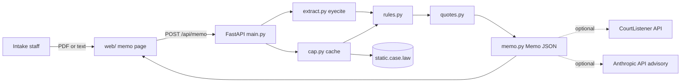

# Architecture — Clerkmark
Mode: hackathon. Last structural change: 2026-09-26 (ADR-0001..0005).

## Overview
Court intake staff upload a filed PDF (or paste text). The server extracts case citations with eyecite, resolves each against the Caselaw Access Project's free static files (reporters → volumes → cases → opinion text), classifies each citation with a deterministic rule, matches quoted passages against the opinion text, and returns one Memo JSON. A plain HTML/CSS/JS page renders it as a typed bench memo with marks, evidence drawers, an evaluation tab and a how-it-works sheet. Optional second source (CourtListener) and optional LLM advisory never change a class. One deployable (FastAPI), no database.

## Components
| Component | Responsibility | Tech | Why it exists (requirement) | When it fails |
|---|---|---|---|---|
| `main.py` | HTTP API + static serving | FastAPI, uvicorn | contract: API.md routes; Vercel zero-config needs `app` in main.py | 5xx envelope; UI keeps input |
| `citememo/extract.py` | PDF → text → citations (+quotes, pins, skipped kinds, unrecognized reporters) | pdfplumber, eyecite, regex | MUST intake; AC-5 | no_text_layer envelope |
| `citememo/cap.py`, `cache.py` | free corpus lookups with two-level cache | httpx, JSON files | MUST lookups; offline mode (AC-7) | per-volume degrade (AC-6) |
| `citememo/rules.py`, `names.py` | deterministic classifier (DECISION-RULE.md) | pure Python | the product's core claim (AC-2, AC-3) | n/a (pure) |
| `citememo/quotes.py` | quote window + token diff | rapidfuzz | AC-4 | falls back to not_found |
| `citememo/memo.py` | orchestration, concurrency (6), timings, tally | asyncio | one Memo per request | partial memo |
| `citememo/courtlistener.py` | optional second source | httpx + token | SHOULD AC-15 | skipped silently, heading says so |
| `citememo/advisory.py` | optional support verdict | Anthropic API, claude-haiku-4-5-20251001 | SHOULD AC-16 | "Advisory: not run" |
| `citememo/evaluate.py` | 20-citation eval vs ground truth | pure Python | AC-1, AC-11, judged technical criterion | error string in S5 |
| `web/` | the memo UI, states, replay, print | HTML/CSS/JS, no framework | UI-SPEC; UX 20% | static; degrades without JS to the how-it-works text |
| `seed/` | synthetic filing, ground truth, CAP cache, replay | files in repo | demo world; offline; R17/R18 | n/a |
| `scripts/verify.sh` | deterministic demo-path check, PASS/FAIL | bash + python | R18; AC-7, AC-11 | exits 1 |

## Data flow

## External services
| Service | Used for | Failure mode | Fallback | Limits / quota |
|---|---|---|---|---|
| static.case.law (CAP) | reporters, volumes, cases, opinion text | timeout/404/5xx | cache; per-volume degrade to not_in_free_corpus | none published; we cache and cap concurrency at 6 |
| CourtListener v4 citation-lookup | optional confirmation of not-held rows | 401 (no token), 429 | skip; heading "not configured" | 60 valid citations/min, 250/request, 64k chars |
| Anthropic Messages API | optional advisory verdict | timeout, refusal, malformed JSON, quota | advisory None | ≤ 20 calls per memo |
| Google Fonts | Courier Prime, Source Serif 4 | blocked network | system font fallbacks in tokens.css | n/a |

## Key decisions
- ADR-0001 CAP static files as the primary corpus (no auth) with CourtListener optional — CourtListener returns 401 without a token; the demo must run without accounts.
- ADR-0002 Deterministic classifier; the LLM is advisory only and off by default — the product's promise is a rule a judge can read; the arXiv finding that models treat absence as fabrication.
- ADR-0003 One FastAPI deployable serving plain HTML/CSS/JS — one page, no routes, zero-config Vercel; a framework would add more code than the UI.
- ADR-0004 No database: on-disk JSON cache + committed seed cache + recorded replay — nothing persists per user; offline demo must work.
- ADR-0005 4 MB upload cap and in-memory per-IP rate limit — Vercel body limit 4.5 MB; public write endpoint needs abuse limits.

## Failure boundaries
- Corpus fetch: 20 s timeout, 1 retry; failure degrades the volume's rows (memo.partial) and the memo still returns. Unbounded inputs are cut: 250 citations, 200k chars, 4 MB.
- Optional services fail silently into labelled "not configured / not run" states; they never block the memo.
- The front end renders all text via textContent (citation text is untrusted input); no HTML injection from filings.
- Idempotency: memo runs are read-only; retries are safe.

## Deployment
Vercel (user's account): root `main.py` exports `app`; `requirements.txt`; `vercel.json` sets `functions.main.py.maxDuration=60`; static via `app.mount('/static', ...)`; env vars optional (`COURTLISTENER_TOKEN`, `ANTHROPIC_API_KEY`, `CITEMEMO_OFFLINE`, `CITEMEMO_CACHE_DIR`). Cache dir falls back to `/tmp` on a read-only FS. Alternatives: `Procfile` for Render/Railway. Rollback: redeploy the previous commit. Local: `uvicorn main:app --reload`.

## Observability
Structured JSON log line per memo run (run_id, filename hash, n citations, class counts, stage timings, sources used, offline flag) to stdout; the same timings are printed on the stamp and the Evaluation tab. An error boundary in the UI shows the §9 error strings.

## Known tradeoffs
CAP coverage ends around 2019–2020 (U.S. Reports at volume 572, F.3d at 935), so recent real cases read "Not in the free library" unless a CourtListener token is configured. Pin cites cannot be verified (no page breaks in CAP text). Statutes and short forms are listed, not checked.
