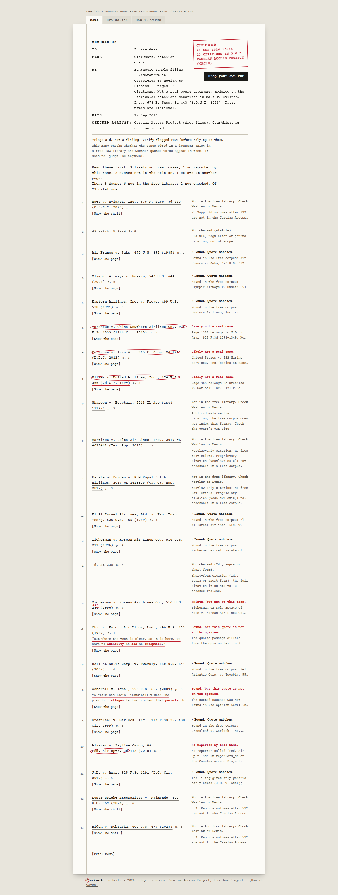
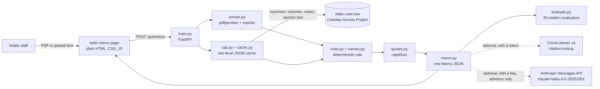

# Clerkmark

**Clerkmark writes the clerk's red-pen memo over every case citation in a filed brief, so court intake staff know which cited cases to check first.**
It keeps "Likely not a real case" apart from "Not in the free library": a naive lookup prints the same "not found" for a made-up case and for a real case the free database does not hold, and Clerkmark prints the rule that told them apart on every row.

A LexHack 2026 entry. Triage aid, not a finding.




- **Video (under 3 minutes):** VIDEO_URL (add before submitting)
- **Live demo:** https://clerkmark.vercel.app/?demo=1 (add before submitting)
- **Write-up:** [DEVPOST.md](DEVPOST.md) · **Video script:** [docs/VIDEO-SCRIPT.md](docs/VIDEO-SCRIPT.md) · **Submission checklist:** [docs/SUBMISSION-CHECKLIST.md](docs/SUBMISSION-CHECKLIST.md)

## What and why

**Who it is for.** Intake staff at a state trial court clerk's office or self-help centre (often not lawyers), or a pro se staff attorney, at the moment a self-represented litigant's filing lands on the docket, before the judge reads it.

**The problem, with sources.**
- Damien Charlotin's [AI Hallucination Cases database](https://www.damiencharlotin.com/hallucinations/) lists **2,079** court decisions that found hallucinated or misquoted citations in filings; **1,196** of them involve a self-represented (pro se) litigant, 57.5%. Figures as of the database's 25 September 2026 update, recorded in [docs/IDEA-CARD.md](docs/IDEA-CARD.md) on 26 September 2026.
- Princeton CITP ([blog post, 27 May 2026](https://blog.citp.princeton.edu/2026/05/27/can-ai-reduce-burdens-on-courts-by-automatically-verifying-citations/), Patty Liu, Dominik Stammbach, Peter Henderson) describes courts spending "large judicial resources tracking down hallucinations and verifying citations", notes that free sources "still do not have complete coverage", and that "Many opinions are only available behind paywalls on Westlaw or Lexis".
- The companion paper ([arXiv 2606.21155](https://arxiv.org/html/2606.21155), v2, August 2026) reports that weaker models "treat absence from CourtListener as evidence of hallucination", and that 19.9% of retrieved opinions lack usable text or pagination.

**Why the split matters.** A checker that reads "not in the free database" as "fake" labels real cases as fabricated, and the person it hurts is the filer without a lawyer. Clerkmark only says "Likely not a real case" when the free library holds the cited volume, the cited page belongs to a different case, and no case in that whole volume carries either party name (or when a closed reporter series is cited past its last volume). Everything it cannot see reads "Not in the free library. Check Westlaw or Lexis."

**What the user does.** Drop the filed PDF (or paste text). The memo comes back as one typed page: every citation in filing order, a plain-word label, the rule sentence that decided it, a red-pen or pencil mark, [Show the page] with the running head of the case the reporter prints at that page, an excerpt of its opinion text and the Caselaw Access Project links, and a "Read these first" paragraph.

## Architecture



One FastAPI deployable, no database, no front-end framework. Details, failure boundaries and the five decisions (ADR-0001 to ADR-0005) are in [ARCHITECTURE.md](ARCHITECTURE.md) and [docs/memory/decisions/](docs/memory/decisions/); the rule is specified in [docs/DECISION-RULE.md](docs/DECISION-RULE.md); the HTTP contract in [docs/API.md](docs/API.md).

## Evidence for each judging criterion

| Criterion | What to look at | Proof in this repo |
|---|---|---|
| Real-World Impact & Feasibility (25%) | A named user (court intake staff) and task (screening a pro se filing's citations); a free data source that needs no account, so a state court could run it | Charlotin: 2,079 decisions, 1,196 pro se (source above). The data source is the Caselaw Access Project's public static files. On the seeded evaluation, real cases marked likely not real: 0 of 11 (`scripts/eval.py --offline`, run 2026-09-27) |
| Technical Execution & Functionality (25%) | The whole pipeline runs end to end on a real PDF; offline proof script; tests | `.venv/bin/python -m pytest -q`: 380 passed, 1 skipped (run 2026-09-27, evidence E0040/E0041; the skip is the opt-in live CAP test). `scripts/eval.py --offline`: 20 of 20 correct. `CITEMEMO_OFFLINE=1 bash scripts/verify.sh`: PASS. CI: [.github/workflows/ci.yml](.github/workflows/ci.yml) |
| User Experience & Design (20%) | Plain-word labels, one action, the litigant sentence, readable errors, every state reachable | Still 1 above. `node qa/qa.mjs --static web`: axe-core 0 violations (tags wcag2a, wcag2aa, wcag21a, wcag21aa, wcag22aa) on 10 views at 1440 px, screenshots at 320, 390, 1024 and 1440 px, the memo prints on one letter page (QA run of 2026-09-26) |
| Innovation & Originality (15%) | "Likely not a real case" kept apart from "Not in the free library", with the rule printed under each row and the evidence one click away | Still 2 above; lines 8 and 9 of the sample; [How the rule works](#how-the-rule-works) |
| Presentation & Documentation (15%) | The 3-minute video, the Devpost write-up, this README | [docs/VIDEO-SCRIPT.md](docs/VIDEO-SCRIPT.md), [DEVPOST.md](DEVPOST.md); `bash scripts/check_readme.sh` checks that every library, API, dataset and model is declared below |

## Live vs simulated

What is real in the running app, part by part. Nothing in the core loop is simulated.

| Part | Status |
|---|---|
| PDF text extraction | Live: pdfplumber on the server; the PDF is read in memory and not kept |
| Citation extraction | Live: eyecite plus a regex that catches citation-like strings with an unknown reporter |
| Caselaw Access Project lookups | Live, cached on disk; offline mode (`CITEMEMO_OFFLINE=1`) serves the same cache. The sample's files are committed in `seed/cache/` |
| Quote matching | Live: rapidfuzz against the opinion text |
| CourtListener second source | Optional: live only when `COURTLISTENER_TOKEN` is set; the memo heading reads "CourtListener: not configured" otherwise. Tested with mocked HTTP only (no token was used during the build) |
| Advisory support check | Optional: live only when `ANTHROPIC_API_KEY` is set; each row reads "Advisory: not run" otherwise. Never changes a class. Tested with a mocked client only |
| Progress while waiting | Not streamed: the status line shows the pipeline's four stage names and a real elapsed timer; nothing is counted |
| The sample filing | Synthetic, and labelled on the memo's RE: line; modeled on the fabricated citations described in Mata v. Avianca, Inc., 678 F. Supp. 3d 443 (S.D.N.Y. 2023); party names are fictional |
| Replay (Alt+Shift+P) | A recorded real run of the sample (`seed/replay.json`, 2026-09-26, network on), shown under a "Replay" banner and stamp |
| `?state=` views | Built from the sample memo in `web/static/fixture-memo.json` so each state can be shown on demand |
| Evaluation ground truth | 20 citations whose expected classes were worked out from the CAP files; `seed/ground_truth.json` lists the URLs and a note per citation |

## Quickstart

Python 3.12 (what CI and the build used).

```bash
uv venv .venv && uv pip install -r requirements.txt     # or: python3 -m venv .venv && .venv/bin/pip install -r requirements.txt
.venv/bin/uvicorn main:app --port 8000
open "http://localhost:8000/?demo=1"                    # Linux: xdg-open
```

`?demo=1` paints the memo over the sample filing. Without it you get the empty sheet: drop a PDF, choose one, or click "Use the sample filing".

**Offline mode.** `CITEMEMO_OFFLINE=1 .venv/bin/uvicorn main:app` makes no network calls: the sample runs from the committed cache, and an uploaded filing resolves only citations whose CAP files are cached. `CITEMEMO_OFFLINE=1 bash scripts/verify.sh` starts its own server on a free port (from `$PORT`, default 8000), runs the sample, reads `/api/eval` and prints PASS or FAIL.

**Demo controls.** `?state=first-run|loading|partial|error|no-results` shows each state; `?reset=1` or Alt+Shift+R returns to the empty sheet; Alt+Shift+P shows the recorded replay; `#evaluation`, `#how` and `#line-6` open a tab or a row.

| Variable | Default | Effect |
|---|---|---|
| `COURTLISTENER_TOKEN` | unset | Adds CourtListener's v4 citation-lookup API as a second source for rows the free library does not hold; a confirmed row becomes "Found" with source CourtListener. Free Law Project documents a limit of 60 valid citations a minute |
| `ANTHROPIC_API_KEY` | unset | Turns on the advisory column (Anthropic Messages API, model `claude-haiku-4-5-20251001`): at most 20 calls per memo, 15 s timeout; never changes a class |
| Google Gemini API (`generativelanguage.googleapis.com`, REST via httpx) | `gemini-3.5-flash-lite` (override with `CITEMEMO_ADVISORY_MODEL`) | Optional advisory column, preferred when `GEMINI_API_KEY` (or `GOOGLE_GENERATIVE_AI_API_KEY`) is set; one call per found row with a quote, at most 20 per memo, 15 s timeout; never changes a class | Google API terms |
| `CITEMEMO_ADVISORY_MODEL` | `claude-haiku-4-5-20251001` | Overrides the advisory model id |
| `CITEMEMO_OFFLINE` | unset | `1` = serve CAP files from the cache only; `memo.offline` is true and the page shows an offline banner |
| `CITEMEMO_CACHE_DIR` | `seed/cache/cap` when writable, else `/tmp/citememo-cache` | Writable cache for fetched CAP files; the committed seed cache is always read as a fallback |
| `CITEMEMO_QUIET` | unset | `1` = no per-run JSON log line on stdout |
| `PORT` | set by the host; `8000` for `scripts/verify.sh` | The port the `Procfile` binds, and the first port `scripts/verify.sh` tries |

All are optional; see [.env.example](.env.example).

## How the rule works

The classifier is plain Python over data fetched from the Caselaw Access Project; no model runs inside it. Steps run in order and the first one that decides wins. The label in quotes is what the memo prints; the class key in brackets is what the Evaluation tab shows. Full specification: [docs/DECISION-RULE.md](docs/DECISION-RULE.md) §2.

0. **Short forms and statutes.** "Id.", "supra", short-form cites and statutes are listed, not checked: "Not checked (Id., supra or short form)." or "Not checked (statute)." [`skipped`]
1. **Unknown reporter.** A citation-like string whose reporter abbreviation neither reporters_db nor the Caselaw Access Project knows: "No reporter by this name." [`unrecognized_reporter`]
2. **Citations no free library holds.** Westlaw-only (`WL`), Lexis-only and public-domain neutral citations (such as `2013 IL App (1st) 111279`): "Not in the free library. Check Westlaw or Lexis." [`not_in_free_corpus`]
3. **Year outside the reporter's years.** Printed as a note only, never a class: the edition years in reporters_db are hand-entered and wrong in places.
4. **Reporter not held.** The free library has no copy of this reporter at all (for example F.4th, which began in 2021): "Not in the free library." [`not_in_free_corpus`]
5. **Volume beyond the library's last volume.** "Not in the free library" (checked in CourtListener when a token is set). The one exception: a closed reporter series that ended at volume 999 (F.2d, F. Supp., F. Supp. 2d) cited at volume 1000 or more reads "Likely not a real case." [`likely_fabricated`]. A volume inside the range that the library lacks reads "Not in the free library". If the library does not answer for a volume, the rows read "Could not reach the free library." [`not_checked`], never "not in the free library".
6. **A case begins at the cited page.** If its name matches the citation: "Found." [`verified`]. If only one distinctive party name matches: "Exists, but not at this page." [`wrong_cite_exists`].
7. **The page sits inside another case, or no held case covers it.** Clerkmark searches every case in the volume for the cited party names. The name is elsewhere in the volume: "Exists, but not at this page." [`wrong_cite_exists`], with the right first page written above the struck one. The page falls in a gap, or past the last case the library holds: "Not in the free library." The page belongs to a different case and no case in the volume carries either party name: "Likely not a real case.", with the real case at that page printed beside it [`likely_fabricated`].
8. **Year check against the matched case.** A year that disagrees with the decision date is printed as a note and never changes the class.
9. **Quotes.** On found cases, quoted words are matched against the opinion text after normalizing curly quotes, hyphens and bracketed alterations. No differing words is a match; otherwise "Found, but this quote is not in the opinion." [`quote_not_found`], with the differing words or the closest passage and its similarity. Pin pages are never checked: the free library's text has no page breaks.
10. **Parallel citations** (for example `516 U.S. 217, 116 S. Ct. 629`) form one row and are confirmed against the case record.
11. **Advisory (optional, needs `ANTHROPIC_API_KEY`).** Does the quoted passage support the sentence it is cited for: supports, does not support, or cannot tell. It never changes the class.

## The seed sample and the evaluation

`seed/sample-motion.pdf` is a synthetic memorandum in opposition to a motion to dismiss: 6 pages, 1,933 words, 23 citations, 20 of them scored (`seed/samples.json`). It mixes the six fabricated case names from Mata v. Avianca (public record) with real Supreme Court and circuit cases, two real 2023 and 2024 Supreme Court cases beyond the free library's coverage, a statute, an "Id." cite and one invented reporter. Expected classes are in `seed/ground_truth.json`.

Output of `.venv/bin/python scripts/eval.py --offline`, run 2026-09-27 (run id 2a21d5ce), rows in the script's order:

| Line | Citation | Expected | Memo said | Match |
|---|---|---|---|---|
| 6 | Varghese v. China Southern Airlines Co., 925 F.3d 1339 (11th Cir. 2019) | likely_fabricated | likely_fabricated | yes |
| 7 | Petersen v. Iran Air, 905 F. Supp. 2d 121 (D.D.C. 2012) | likely_fabricated | likely_fabricated | yes |
| 8 | Miller v. United Airlines, Inc., 174 F.3d 366 (2d Cir. 1999) | likely_fabricated | likely_fabricated | yes |
| 9 | Shaboon v. Egyptair, 2013 IL App (1st) 111279 | not_in_free_corpus | not_in_free_corpus | yes |
| 10 | Martinez v. Delta Air Lines, Inc., 2019 WL 4639462 (Tex. App. 2019) | not_in_free_corpus | not_in_free_corpus | yes |
| 11 | Estate of Durden v. KLM Royal Dutch Airlines, 2017 WL 2418825 (Ga. Ct. App. 2017) | not_in_free_corpus | not_in_free_corpus | yes |
| 13 | Zicherman v. Korean Air Lines Co., 516 U.S. 217 (1996) | verified | verified | yes |
| 12 | El Al Israel Airlines, Ltd. v. Tsui Yuan Tseng, 525 U.S. 155 (1999) | verified | verified | yes |
| 4 | Olympic Airways v. Husain, 540 U.S. 644 (2004) | verified | verified | yes |
| 3 | Air France v. Saks, 470 U.S. 392 (1985) | verified | verified | yes |
| 5 | Eastern Airlines, Inc. v. Floyd, 499 U.S. 530 (1991) | verified | verified | yes |
| 21 | J.D. v. Azar, 925 F.3d 1291 (D.C. Cir. 2019) | verified | verified | yes |
| 19 | Greenleaf v. Garlock, Inc., 174 F.3d 352 (3d Cir. 1999) | verified | verified | yes |
| 17 | Bell Atlantic Corp. v. Twombly, 550 U.S. 544 (2007) | verified | verified | yes |
| 18 | Ashcroft v. Iqbal, 556 U.S. 662 (2009) | quote_not_found | quote_not_found | yes |
| 16 | Chan v. Korean Air Lines, Ltd., 490 U.S. 122 (1989) | quote_not_found | quote_not_found | yes |
| 23 | Biden v. Nebraska, 600 U.S. 477 (2023) | not_in_free_corpus or verified | not_in_free_corpus | yes |
| 22 | Loper Bright Enterprises v. Raimondo, 603 U.S. 369 (2024) | not_in_free_corpus or verified | not_in_free_corpus | yes |
| 15 | Zicherman v. Korean Air Lines Co., 516 U.S. 230 (1996) | wrong_cite_exists | wrong_cite_exists | yes |
| 20 | Alvarez v. Skyline Cargo, 88 Fed. Air Rptr. 3d 412 (2018) | unrecognized_reporter | unrecognized_reporter | yes |

```text
Correct classes: 20 of 20 (accuracy 1.000)
Real cases marked likely not real: 0 of 11
Stages (ms): extract 1414 · lookup 727 · classify 269 · quotes 1674 · advisory not run · elapsed 4091
```

"0 of 11" counts the 11 scored rows with a real case at the cited page (8 found, 2 quote not in the opinion, 1 exists at another page). Biden v. Nebraska and Loper Bright are real too, but sit beyond the free library's last U.S. Reports volume (572), so the memo says "Not in the free library". The recorded live run with the network on took 4.1 s for the 23 citations (`seed/replay.json`, 26 September 2026). These timings come from a WSL2 laptop, where Python's monotonic clock was seen to overstate elapsed time by about 1.2 s (build note F-0003). The 20 citations were written by the same team that wrote the rule: the evaluation shows that the rule does what its specification says on known inputs. It does not measure accuracy on real filings.

## Deploy

**Vercel (zero-config).** The repo is already shaped for it: root `main.py` exports the FastAPI `app`, `requirements.txt` lists the packages, and `vercel.json` gives the function 60 s (`maxDuration`).

1. Push the repo to GitHub and import it in Vercel (Add New, Project). Leave the build command and output directory empty.
2. Optional: add `COURTLISTENER_TOKEN` and/or `ANTHROPIC_API_KEY` under Settings, Environment Variables.
3. Deploy, then check the routes: `python3 .prod-build/pb.py smoke https://clerkmark.vercel.app --routes / /api/health /api/samples`, and open `https://clerkmark.vercel.app/?demo=1`.

Vercel's file system is read-only except `/tmp`, so fetched CAP files are cached in `/tmp/citememo-cache`; the committed seed cache (`seed/cache/`, about 24 MB) is read for the sample. Vercel refuses request bodies over 4.5 MB, which is why uploads are capped at 4 MB.

**Any other host.** The `Procfile` runs `uvicorn main:app --host 0.0.0.0 --port $PORT` (Render, Railway and similar).

Step-by-step, with the last-hour checks: [docs/SUBMISSION-CHECKLIST.md](docs/SUBMISSION-CHECKLIST.md).

## Tech stack

Every runtime and development package in `requirements.txt`, every API, dataset, model, font and tool used. Versions are the pinned ones; licenses are from each package's metadata.

| Name | Version | Purpose | License |
|---|---|---|---|
| fastapi | 0.141.1 | HTTP API and static file serving (`main.py`) | MIT |
| uvicorn | 0.54.0 | ASGI server | BSD-3-Clause |
| python-multipart | 0.0.32 | Parses PDF uploads (multipart form data) for FastAPI | Apache-2.0 |
| pydantic | 2.13.5 | API models and validation (`citememo/models.py`) | MIT |
| pdfplumber | 0.11.10 | Reads the PDF's text layer | MIT |
| eyecite | 2.7.8 | Finds case citations in the text (Free Law Project) | BSD-2-Clause |
| reporters-db | 3.2.66 | Reporter abbreviations and edition years (Free Law Project) | BSD-2-Clause |
| courts-db | 0.10.27 | Court names database that eyecite uses (Free Law Project) | BSD-2-Clause |
| httpx | 0.28.1 | HTTP client for the Caselaw Access Project files and CourtListener | BSD-3-Clause |
| rapidfuzz | 3.14.6 | Quote matching: closest passage and similarity | MIT |
| anthropic | 1.8.0 | Client for the optional advisory check (Anthropic Messages API) | MIT |
| fpdf2 | 2.8.8 | Renders the synthetic sample PDF from its text (`scripts/make_seed_pdf.py`) | LGPL-3.0-only |
| pytest | 9.1.1 | Test runner (`tests/`) | MIT |
| Caselaw Access Project static files | static.case.law, fetched 2026-09-26 | The free case-law corpus: reporters, volumes, cases and opinion text (Harvard Law School Library Innovation Lab); no account needed | See case.law |
| CourtListener v4 citation-lookup API | v4 | Optional second source when `COURTLISTENER_TOKEN` is set (Free Law Project) | Free Law Project terms |
| Anthropic Messages API | model `claude-haiku-4-5-20251001` | Optional advisory verdict on found rows with a quote, when `ANTHROPIC_API_KEY` is set | Anthropic terms |
| Google Fonts: Courier Prime, Source Serif 4 | n/a | The memo's typewriter face and the reporter page's serif | SIL Open Font License 1.1 |
| Plain HTML, CSS and JavaScript | n/a | The memo page (`web/`), no framework and no build step | n/a (this repo) |
| Playwright (dev) | 1.63.0 | Browser QA: screenshots at four widths, keyboard and print checks (`qa/qa.mjs`) | Apache-2.0 |
| axe-core and @axe-core/playwright (dev) | 4.13.0 | Accessibility checks in the QA script | MPL-2.0 |
| Vercel | n/a | Hosting target (Python function) | n/a |
| GitHub Actions | n/a | CI: tests, offline demo proof, README check | n/a |
| Python | 3.12 | Runtime | PSF |

## Limitations

What the memo does not do, stated plainly:

- **Statutes, court rules, Id., supra and short-form citations** are listed as "Not checked", not verified.
- **Pin cites are not checked.** The free library's opinion text has no page breaks; rows say "Pin page not checked".
- **Westlaw-only, Lexis-only and neutral citations** read "Not in the free library": the memo cannot tell whether those cases exist. In the sample, three of the six Mata v. Avianca case names are cited this way (lines 9 to 11), so they read "Not in the free library", not "Likely not a real case". That is the rule working as designed.
- **Coverage ends around 2019–2020.** The Caselaw Access Project holds U.S. Reports to volume 572 (2014), F.3d to volume 935 and F. Supp. 2d to volume 999, and no F.4th. Recent real cases read "Not in the free library" unless a CourtListener token is set.
- **No OCR.** A scanned PDF without a text layer gets "No text layer in this PDF".
- **Triage aid, not a finding.** "Likely not a real case" is an observation about the reporter's pages, not a finding about the filer. Staff verify flagged rows before relying on them.
- **Misrepresented propositions** (a real case cited for something it does not say) are the largest category in Charlotin's database: 873 of the 2,079 decisions, 42.0% (same source and date as above). Clerkmark covers them only through the optional advisory column, only when an Anthropic key is set, and never as a class.
- **Generic captions.** A fabricated citation whose only party names are generic ("United States v. Doe") is never marked red: there is no distinctive name to search for.
- **Optional services untested live.** The CourtListener and advisory paths are tested with mocked HTTP and a mocked client; no token or key was used during the build.
- **Limits.** Uploads up to 4 MB, pasted text up to 200,000 characters, up to 250 citations per memo, 10 memos a minute per address. The rate limit lives in memory, so on a serverless host it applies per running instance, not globally.
- **No user research.** No clerk or staff attorney was interviewed; the user and the task come from the published sources above.

**Deviations from the design documents (logged):**
- The upload cap is **4 MB**, not the 20 MB in UI-SPEC §9 or the 15 MB the first version of docs/API.md gave, because Vercel refuses request bodies over 4.5 MB (ADR-0005). docs/UI-SPEC.md §9 now says "larger than 4 MB" and docs/API.md says 4 MB.
- A **`rate_limited` (429)** error envelope, with a `Retry-After` header, was added for the per-address limit; it is listed in docs/API.md §1.1.
- The evidence for each row is embedded in the memo JSON instead of a separate `GET /api/evidence/{row}` route (docs/API.md §0).
- When the free library does not answer for a volume, its rows read "Could not reach the free library." (`not_checked`) rather than "Not in the free library", so an outage is never shown as absence.

## Credits

- **Caselaw Access Project** (Harvard Law School Library Innovation Lab) for the free case-law files at static.case.law.
- **Free Law Project** for CourtListener, eyecite, reporters-db and courts-db.
- **Princeton CITP**: Patty Liu, Dominik Stammbach and Peter Henderson's work on automatic citation verification, the LePhantomCite benchmark and the legal-hallucination agent ([blog post](https://blog.citp.princeton.edu/2026/05/27/can-ai-reduce-burdens-on-courts-by-automatically-verifying-citations/), [arXiv 2606.21155](https://arxiv.org/html/2606.21155)). Their error classes, and their warning that absence from a free corpus is not proof of fabrication, shaped the rule.
- **Damien Charlotin's** [AI Hallucination Cases database](https://www.damiencharlotin.com/hallucinations/) for the numbers behind the problem.
- **Mata v. Avianca, Inc.**, 678 F. Supp. 3d 443 (S.D.N.Y. 2023), the public record whose fabricated citations the synthetic sample is modeled on.

## Built during LexHack 2026

Clerkmark was designed and built during LexHack 2026; the repository's first commit is dated 26 September 2026, 13:49 UTC, and the git history shows every step. The code was written with AI coding assistants (Claude Code, with Anthropic's Claude models) under human direction. Every module and its reason for existing is explained in [ARCHITECTURE.md](ARCHITECTURE.md), the five design decisions in [docs/memory/decisions/](docs/memory/decisions/), and the rule in [docs/DECISION-RULE.md](docs/DECISION-RULE.md); the instructions the assistants followed are committed in [AGENTS.md](AGENTS.md). The team can walk through any part of the code.

## Quality

- **Tests:** 380 passed, 1 skipped, from `.venv/bin/python -m pytest -q` on 27 September 2026 (nine files under `tests/`, including a security suite and a Bluebook never-red sweep over every cached case; the skipped test fetches from static.case.law and runs only with `CITEMEMO_LIVE=1`).
- **Evaluation:** 20 of 20 citations in their expected class, 0 of 11 real cases marked likely not real (`scripts/eval.py --offline`, 27 September 2026).
- **Demo proof:** `CITEMEMO_OFFLINE=1 bash scripts/verify.sh` printed "citations 20 · correct 20/20 · real cases marked likely-not-real 0 · elapsed 4.0 s" and PASS on 27 September 2026.
- **Interface:** 0 axe-core violations on 10 views at 1440 px and the memo fits one printed letter page (`node qa/qa.mjs --static web`, 26 September 2026).
- **Review and QA findings (fresh-context review and QA gate):**
**Review and QA findings.** A fresh-context review (T09, `.prod-build/reports/T09-review.md`) listed 15 findings: 6 blocking ones were reproduced and fixed through failing tests (Bluebook-abbreviated party names such as *EEOC v. Arabian Am. Oil Co.* had read "Likely not a real case"; an eyecite 2.7.8 party bleed across string cites; the upload's file name in the run log; a chunked upload read past 4 MB; a wrong-shape corpus reply cached as coverage; missing security headers), 1 hardening item (nosniff, referrer policy and a Content-Security-Policy on HTML), and 8 open or dismissed non-blocking notes (the sample endpoint is uncached and unthrottled; the rate-limit key trusts the first X-Forwarded-For hop; popular-name captions such as *In re Fannie Mae* read "Exists, but not at this page" rather than "Found"; `HEAD /` answers 405; `/api/health` shows the cache path). `pip-audit` found no known vulnerabilities. The QA gate (T08, `.prod-build/reports/T08.md`) ran the demo flow three times with a reset between runs with identical results, 0 axe violations on every state at 1440, a keyboard-only golden path, a one-page print, and a two-round fresh-eyes evaluation on stills only (`qa/out/skeptic.md`), after which the "Read these first" tally moved to the top of the memo.

## License

MIT, see [LICENSE](LICENSE).
